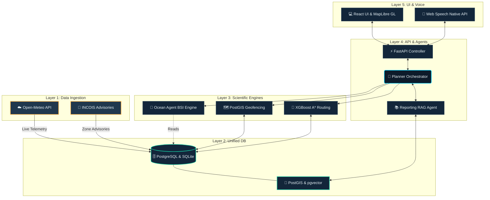
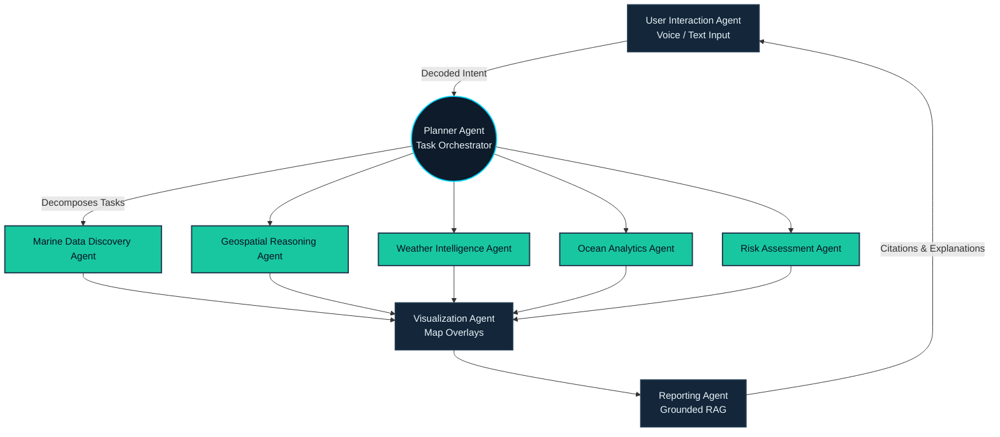

  <h1>🌊 Mavericks: Navik Marine Portal</h1>
  
<strong>Intelligent Spatial Decision Support Platform for Marine Safety</strong>

---

## 📖 About the Project

**Mavericks: Navik Marine Portal** is an advanced, intelligent spatial decision support platform developed as our implementation for the **Smart India Hackathon (SIH26176)** problem statement. The project was born out of a critical need to enhance maritime safety and resource optimization for fishermen and coastal authorities operating in the North Indian Ocean.

We created this project to bridge the gap between complex meteorological data and practical, safety-critical maritime guidance. By translating raw oceanographic telemetry into explainable, localized risk assessments and optimized routing, our solution ensures that vessels can safely navigate to Potential Fishing Zones (PFZs) while strictly adhering to international maritime boundaries and marine protected areas (MPAs). 

*Note: This project is our official submission and implementation for the SIH26176 problem statement that our team chose to implement.*

---

## 🛠️ Technology Stack

Our platform leverages a modern, robust technology stack, integrating spatial databases, machine learning, and concurrent AI agents behind a unified deployment model:

### **Frontend (UI & Interaction)**
* **React** – Dynamic client interfaces.
* **MapLibre GL** – High-performance vector map rendering.
* **Web Speech API** – Native zero-cost multilingual voice inputs and text-to-speech read-aloud advice (English, Hindi, Marathi).

### **Backend (API & Orchestration)**
* **FastAPI** – High-speed, asynchronous REST APIs serving statically built frontend assets.
* **Python** – Core backend logic and agent orchestration.

### **Data & Spatial Engines**
* **Neon PostgreSQL** – Central datastore.
* **PostGIS** – Spatial database engine for predictive geofencing (`ST_Contains`, `ST_Distance`).
* **pgvector** – Vector database for semantic RAG queries.
* **SQLite / Local GeoJSON** – Offline-first fallback cache for system resilience.

### **Machine Learning & Analytics**
* **XGBoost Classifier** – Machine learning risk predictor paired with deterministic safety floors.
* **NetworkX** – A* pathfinding for safe route optimization.
* **BGE-M3 Embeddings** – Semantic chunk processing for the regulatory advisor.

---

## 📐 Architecture Diagram

The system coordinates distributed data discovery, spatial boundary checks, and ML risk modeling. The architecture ensures that every layer interacts seamlessly, from the browser UI down to the scientific modeling engines.

---

## 🤖 9-Agent Orchestration Flowchart

To handle complex maritime inquiries, the platform relies on **9 specialized, concurrent AI agents**. This multi-agent orchestration breaks down complex requests (like *"Is it safe to fish at PFZ-17 leaving tomorrow at 6am?"*) into parallel workflows.

### Agent Roles:
1. **User Interaction Agent:** Handles multilingual voice/text processing and UI.
2. **Planner Agent:** Orchestrates tasks and handles failsafe fallbacks (SQLite/JSON caching) if servers go offline.
3. **Marine Data Discovery Agent:** Retrieves and translates telemetry grids from remote endpoints.
4. **Weather Intelligence Agent:** Evaluates meteorological hazards like wind, visibility, and lightning.
5. **Ocean Analytics Agent:** Computes Potential Fishing Zones (PFZs) using SST and Chlorophyll-a parameters.
6. **Geospatial Reasoning Agent:** Geofences vessels to prevent border or marine sanctuary incursions.
7. **Risk Assessment Agent:** Runs machine learning safety classifiers constrained by strict deterministic thresholds (e.g., overriding ML if wave heights exceed 4m).
8. **Visualization Agent:** Synthesizes geospatial data into optimized route visualizations.
9. **Reporting Agent:** Cross-references calculations with official maritime regulations via pgvector, providing explainable and cited advisories.

---

## 🌟 Core Features

- **Marine Risk Predictor:** Generates localized safety profiles using an XGBoost Classifier combined with official safety floors to prevent "black box" decisions.
- **Safe-Route Optimization:** Projects ocean current vectors onto vessel bearings to compute fast, low-drag routes around high-risk regions and restricted boundaries.
- **Predictive Geofencing:** Utilizes PostGIS database lookups against the `india_eez` and `marine_protected_areas` tables to actively warn vessels approaching restricted zones.
- **Grounded Safety Advisor:** RAG implementation citing official clauses from maritime manuals, processed completely within our vector datastore.
- **Offline-First Resilience:** Ensures uninterrupted guidance. If primary live APIs fail, the Planner Agent routes processes to local SQLite boundaries and cached static JSON datasets.
- **Multilingual Voice Outreach:** Seamless communication across languages to provide highly accessible insights to all end users.
