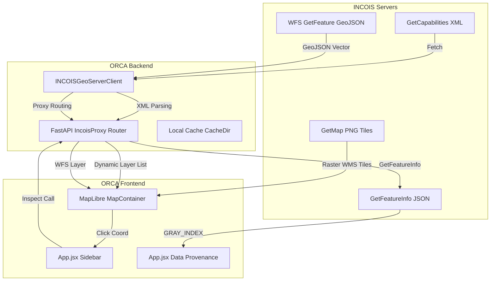

# INCOIS GeoServer WMS/WFS Integration Reference

This document describes the technical architecture and integration mapping for consuming official, live INCOIS satellite-derived ocean color/temperature raster heatmaps and Potential Fishing Zone (PFZ) vector contour advisories in the ORCA platform.

---

## 1. Architecture Flow Diagram



---

## 2. Dynamic Layer Discovery (GetCapabilities)
Instead of hardcoding layer assets, ORCA dynamically discovers available layers at server startup/refresh.
* **Service:** `WMS`
* **Request:** `GetCapabilities`
* **Endpoint:** `https://incois.gov.in/geoserver/PFZ-TUNA-SST-CHL/ows`
* **Logic:** `INCOISGeoServerClient.get_capabilities()` parses the XML namespace tree (`http://www.opengis.net/wms`) using ElementTree to extract matching `<Layer>` variables. It caches capabilities locally under `cache/incois_capabilities.json` with a 24-hour TTL.
* **Downtime Fallback:** If the connection to `incois.gov.in` fails or times out, the client automatically falls back to reading the expired local cache file or hardcoded verified defaults (such as `PFZ-TUNA-SST-CHL:sst` and `PFZ-TUNA-SST-CHL:chl`).

---

## 3. Map Visualization (GetMap)
* **Format:** `image/png`
* **Styles:**
  * **SST**: Uses the official `PFZ-TUNA-CHL-SST` styled lookup scale to match standard INCOIS geoportal formatting.
  * **Chlorophyll**: Uses the official `pfz_tuna_chl_sld` styled lookup scale.
* **MapLibre integration:** Layers are added as standard `'raster'` sources using bounding box coordinates templates `{bbox-epsg-3857}`.
* **Visual Controls:** Opacity sliders (defaulting to `65%`) are rendered directly inside the **Map Layers** legend box to allow overlaying thermal gradients cleanly above CARTO base tiles without obscuring EEZ and restricted MPA boundaries.

---

## 4. Coordinate Inspection (GetFeatureInfo)
* **Format:** `application/json`
* **Trigger:** Click events on ocean waters or grid cells.
* **Query:**
  ```python
  INCOISGeoServerClient.get_feature_info(lat, lon, "PFZ-TUNA-SST-CHL:sst")
  ```
  This creates a minute $0.01^\circ \times 0.01^\circ$ bounding box around the clicked coordinates and fetches the center pixel data.
* **Parsing:** Extracts the numeric observation value under the key `properties.GRAY_INDEX` returned in the feature collection.
* **Outcome:** Displays actual numeric sea surface temperature (e.g. `28.6 °C`) and chlorophyll concentrations (e.g. `0.235 mg/m³`) inside the sidebar panel.

---

## 5. Potential Fishing Zone Lines (WFS GetFeature)
* **Format:** GeoJSON
* **Layer:** `PFZ_Automation:pfzlines`
* **Endpoint:** `https://incois.gov.in/geoserver/PFZ_Automation/ows`
* **Integration:** Fetched dynamically via WFS and styled in MapLibre as a distinct yellow vector stroke (`#eab308`). Clicking on any vector segment parses attributes (such as sectorId and advisory dates) and prints them in a map popup.

---

## 6. Scientific Constraints & Traceability
1. **No Abundance Inference:** Sea Surface Temperature gradients and chlorophyll concentration fronts represent oceanographic *environment observations* only. ORCA strictly tags them as supporting telemetry and never calculates "fish count/abundance" directly from them, preserving professional scientific limits.
2. **Official PFZs:** Lines labeled `INCOIS PFZ Lines` represent official vector contours produced directly by INCOIS oceanographers, maintaining clear trace boundaries.
3. **Data Provenance:** Displays source, dataset name, layer name, query time, and coordinates for every single click.
